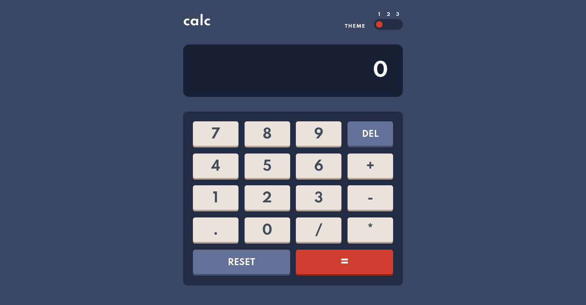
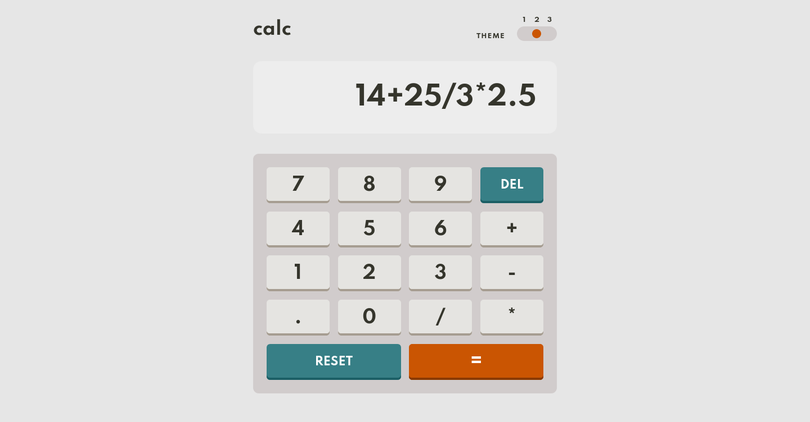
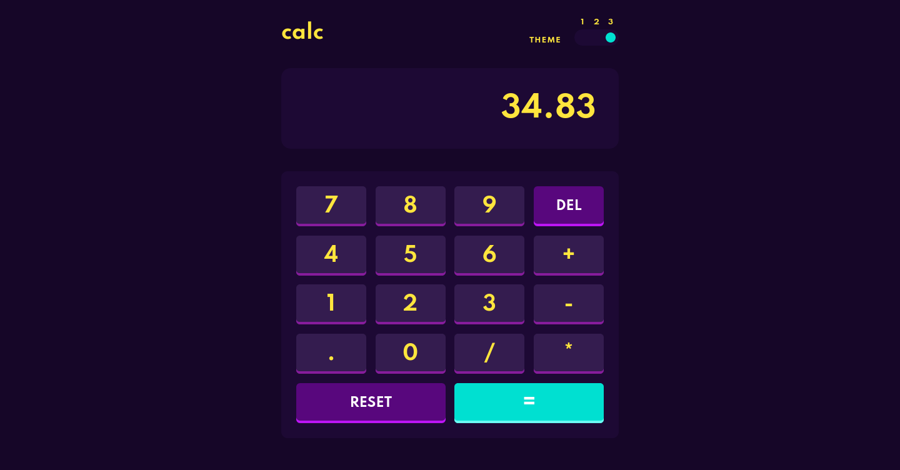
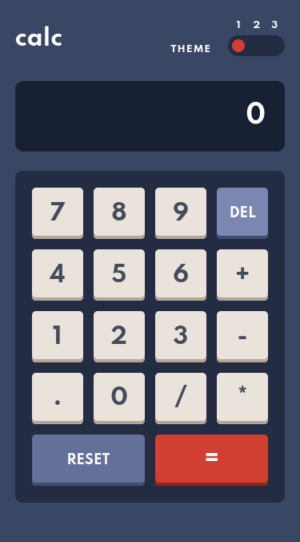
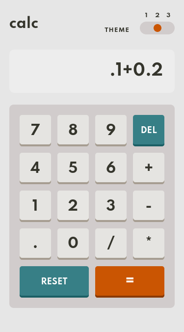
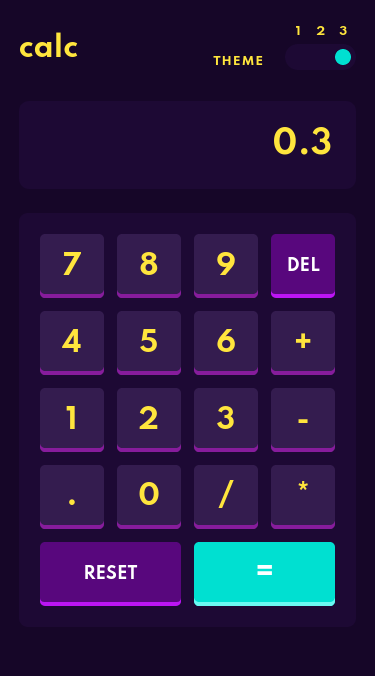

# Frontend Mentor - Calculator app solution

This is a solution to the [Calculator app challenge on Frontend Mentor](https://www.frontendmentor.io/challenges/calculator-app-9lteq5N29). Frontend Mentor challenges help you improve your coding skills by building realistic projects. 

## Table of contents

- [Overview](#overview)
  - [The challenge](#the-challenge)
  - [Screenshot](#screenshot)
  - [Links](#links)
- [My process](#my-process)
  - [Built with](#built-with)
  - [What I learned](#what-i-learned)
  - [Useful resources](#useful-resources)
- [Author](#author)

## Overview

### The challenge

Users should be able to:

- See the size of the elements adjust based on their device's screen size
- Perform mathmatical operations like addition, subtraction, multiplication, and division
- Adjust the color theme based on their preference
- **Bonus**: Have their initial theme preference checked using `prefers-color-scheme` and have any additional changes saved in the browser

### Screenshot

  
Desktop

  
Mobile

### Links

- Solution URL: [Frontend Mentor Solution](https://www.frontendmentor.io/solutions/calculator-app-using-gulp-sass-js-bem-html-responsive-design-TRMnR7Kz1)
- Live Site URL: [Github Pages](https://rzvr.github.io/calculator-app/)

## My process

### Built with

- Semantic HTML5 markup
- BEM
- SASS
- CSS variables
- JS
- Gulp
- Responsive design
- Mobile-first workflow

## Author

- Github - [rzvr](https://github.com/rzvr)
- Codewars - [rzvr](https://www.codewars.com/users/rzvr)
- LinkedIn - [Roman Zvir](https://www.linkedin.com/in/roman-zvir-8a4394214)
- Frontend Mentor - [rzvr](https://www.frontendmentor.io/profile/rzvr)